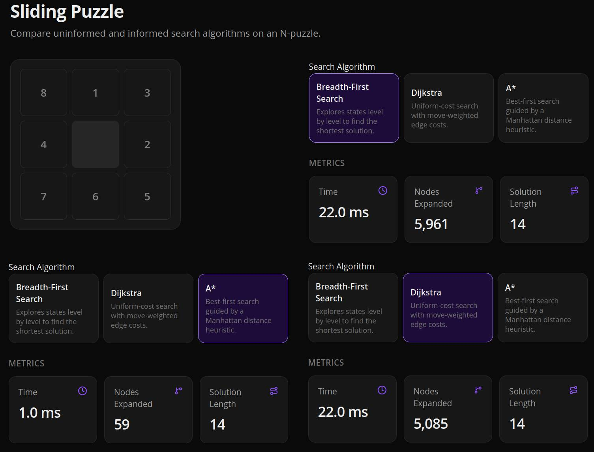
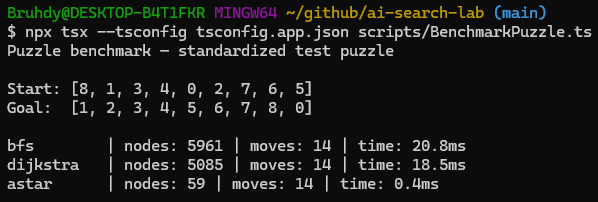
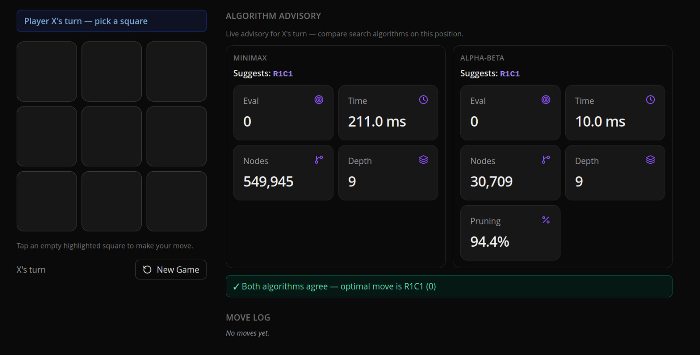
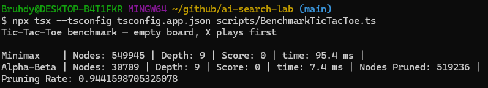

# Comparative Analysis Report

**Kristian Correa, Broudy Negron**  
**CAI 4002 — Prof. Su**

---

## 1. Structural Comparison

> *How does the search space of the 8-puzzle compare structurally to the game tree of Tic-Tac-Toe? What is similar, and what is fundamentally different? (Consider who controls the next state, and what "solving" means in each case.)*

The 8-puzzle game is a deterministic environment controlled by a single agent. The goal is to find a path to a winning state in the smallest amount of moves possible. The Tic-Tac-Toe game is a competitive and strategic environment with 2 agents making moves. The goal is to find a state in which the Max player has the best possible score while being undermined by the Min player.

The main difference between the 2 are their goals. The 8-puzzle attempts to find a specific, unchanging sequence of index positions as the goal. This means that its wants it's goal state to look like [1,2,3,4,5,6,7,8,0] and will perform movements to reach that goal state. It also always has a path to the goal state as there are no limitations or bounds that would end the game besides reaching the goal state or quitting the game. However, the Tic-Tac-Toe game has a specific line sequence (such as 3 X's in a row) as its goal state and can be achieved in various ways, for example horizontally or diagonally. There are also multiple terminal states that have different values to each other. For example, a victory for the X player would not have the same value as a tie.

---

## 2. Algorithm Fit

> *Why is A\* appropriate for the 8-puzzle but not directly applicable to Tic-Tac-Toe? Conversely, why does Minimax not naturally apply to the 8-puzzle?*

The A* algorithm is appropriate for the 8-puzzle but not to Tic-Tac-Toe the former has a direct and unchanging goal state while the latter has to compete against another agent making decisions, which can have various different terminal states. Furthermore, Tic-Tac-Toe cares about the value of the terminal state (win, draw, or loss) and not how to most effectively reach those states. The A* algorithm is designed to find the least-cost path and, as such, is more suited to the 8-Puzzle.

Minimax does not naturally apply to the 8-puzzle because there is no opposing agent trying to minimize our outcome. The puzzle is a single-agent search problem: every legal slide is under our control, and “solving” means finding a minimum-cost path to one fixed goal configuration, not choosing a move against an adversary. Minimax’s MAX/MIN alternating layers models two players with opposing goals, which does not match the puzzle’s state space.

---

## 3. Empirical Comparison — Module A

> *Report nodes expanded for blind search, Dijkstra, and A\* on the standardized test puzzle. What does this tell you about the value of heuristic information?*

On the standardized test puzzle (start `[8,1,3,4,0,2,7,6,5]`, goal `[1,2,3,4,5,6,7,8,0]`, optimal solution length 14 moves), BFS expanded the most nodes, followed by Dijkstra, and then A*. BFS is blind search with no heuristic: it finds the shortest path by going level by level, which took 5961 nodes expanded. Dijkstra is uniform-cost search (not heuristic-guided); it tracks the cost to reach each state and expands 5085 nodes on this puzzle, similar to BFS since every move has the same cost. A* adds Manhattan Distance as an informed heuristic on top of path cost, so it is pulled toward the goal while still finding the cheapest path. It only needed 59 nodes expanded to reach the goal in 14 moves. That is roughly a 100x reduction compared to BFS, which surprised us at how much an admissible heuristic can shrink the search. This tells us that heuristic information creates an informed search that finds a path much faster, though it does add some implementation complexity.

**Module A — dashboard metrics**

**Module A — CLI benchmark**

---

## 4. Empirical Comparison — Module B

> *Report nodes explored by Minimax vs Alpha-Beta on the standardized test position (empty board, X plays first). Compute and report the observed pruning rate.*

*(Note: Pruning Rate is part of the Alpha-Beta Algorithm and is after the Nodes Pruned)*

The Minimax algorithm searches all nodes to the terminal state, and attempts to maximize its score against a minimizing player. The Max player chooses the max score of its children nodes and the Min player chooses the min score of its children nodes. They alternate turns as to simulate a competitive multi-agent environment. As such, it takes a long time to search through all 549,945 nodes. Alpha-Beta Pruning has a similar algorithm to min-max, except it stores a global Max and Min value that is guaranteed (Alpha and Beta respectively). This process is called pruning and allows the algorithm to skip any nodes that would not affect the final decision between the Min and Max players. As such, it has a significantly less amount of nodes explored, because there are other nodes that are already guaranteed to give a higher score so the lower score nodes are skipped. The Alpha-Beta Pruning only visits 30,709 nodes and prunes 519,236. The total of these 2 is 549,945 which is the amount of nodes visited by the normal Minimax. The Pruning Rate is calculated using the following formula (minimax nodes − alpha-beta nodes) / minimax nodes = (549,945 − 30,709) / 549,945 ≈ 94.4%, meaning about 94% of the minimax tree was pruned while still returning the same optimal move.

**Module B — dashboard metrics**

**Module B — CLI benchmark**

---

## 5. Trade-off Analysis

> *Briefly discuss completeness, optimality, time complexity, and space complexity for each algorithm (one sentence per property per algorithm).*

### Completeness

- **BFS** is complete as it guarantees to find a path to the goal state if one exists by searching all nodes level by level.
- **Dijkstra** is complete as it guarantees to find a path to the goal state if one exists by exploring states in order of lowest path cost so far.
- **A\*** is complete as it guarantees to find a path to the goal state if one exists, using least-cost search guided by a heuristic (we used Manhattan Distance).
- **Minimax** is complete on a finite game tree as it searches all nodes to terminal states and therefore evaluates every possible outcome.
- **Alpha-Beta Pruning** is complete as it returns the same result as Minimax while only skipping branches that cannot change the final minimax decision.

### Optimality

- **BFS** is only optimal if each edge has the same cost, as it finds the shortest path in number of moves.
- **Dijkstra** is optimal as it finds the least-cost path to the goal state when edge costs are non-negative.
- **A\*** is optimal when the heuristic is admissible (never overestimates), as Manhattan Distance does on our puzzle.
- **Minimax** selects the best move assuming the opponent also plays optimally (max vs min at alternating levels).
- **Alpha-Beta Pruning** is decision-equivalent to Minimax (same optimal move) but visits fewer nodes because of pruning.

### Time Complexity

- **BFS** has a time complexity of O(|V| + |E|) where V is the number of nodes and E is the number of edges.
- **Dijkstra** has a time complexity of O((|V| + |E|) log |V|) where V is the number of nodes and E is the number of edges.
- **A\*** has a time complexity of O(b^m) where b is the branching factor and m is the max depth possible.
- **Minimax** has a time complexity of O(b^m) where b is the branching factor and m is the max depth possible.
- **Alpha-Beta Pruning** has an average time complexity of O(b^(m/2)) where b is the branching factor and m is the max depth possible; its worst case is O(b^m).

### Space Complexity

- **BFS** has a space complexity of O(|V|) where V is the number of nodes.
- **Dijkstra** has a space complexity of O(|V|) where V is the number of nodes.
- **A\*** has a space complexity of O(b^m) where b is the branching factor and m is the max depth possible.
- **Minimax** has a space complexity of O(b * m) where b is the branching factor and m is the max depth possible.
- **Alpha-Beta Pruning** has a space complexity of O(b * m) where b is the branching factor and m is the max depth possible.

---

## Heuristic Justification

> *Explain why the chosen A\* heuristic never overestimates the true cost.*

We chose the Manhattan distance as our heuristic. For each tile, it sums the minimum row steps and column steps to its goal position. Since only one tile moves one square per turn, the total Manhattan distance can decrease by at most 1 per move, so the true solution length can never be shorter than that sum. Therefore the heuristic never overestimates.